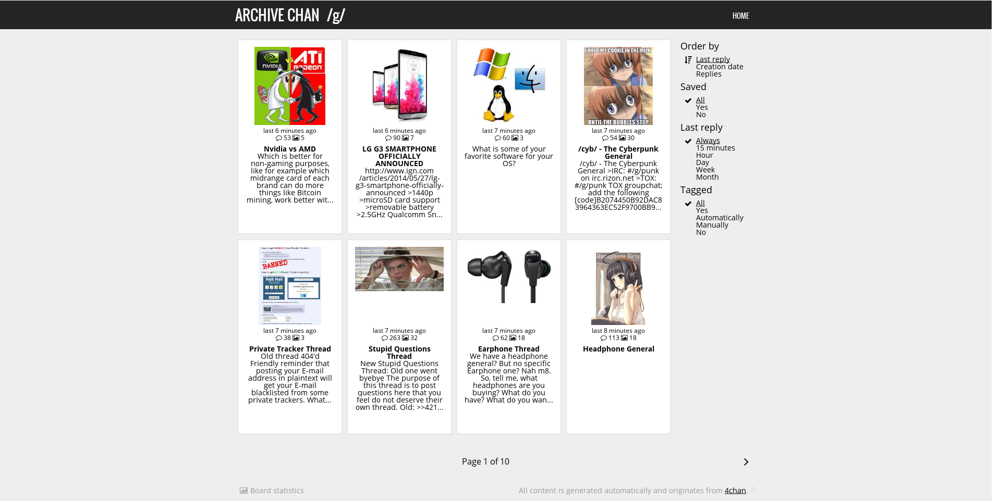

# Archive Chan
Archive Chan is a 4chan archive using Flask.

[More screenshots](http://archivechan.imgur.com/)

### Installation and configuration
Detailed guides are available in the `docs` directory.

## Contributions
All help is greatly appreciated. If you have encountered a bug create an issue
for it. You an also email me directly.

You have to run `tools/make.py` after changing static JS or CSS files. Required
files will be preprocessed, minified and concatenated. This script requires
`yui-compressor`, `sass` and `cat`.
